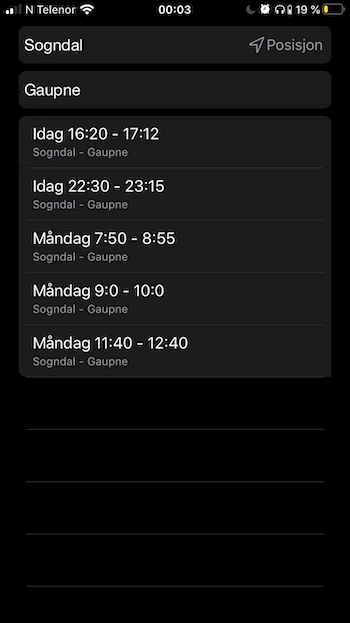
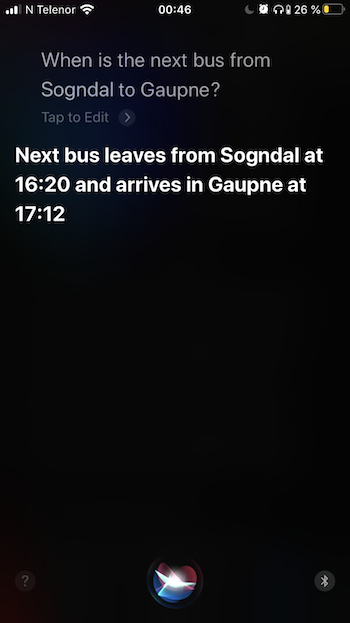

# EnturSIRI
## Making SIRI compatible with Entur. Finding bus routes from A to B has never been easier.
Using the [Entur API](https://developer.entur.org/pages-intro-overview), and the **SIRI Shortcuts** feature in iOS 12.

# Instructions
1. Build and install the application
2. Jump into the app, and specify Start point (Fra) and End point (Til), and Search.
3. If you are on iOS 12 : Go to Settings > Siri > Shortcuts, and add one shortcut from EnturSIRI
3. If you are on iOS 13 : Go to Shortcuts > Gallery > “Shortcuts from your apps”, and add one from EnturSIRI
4. Request the next bus times from SIRI!

# Behind The Scenes
This is an app made for iOS 12 and newer, depending on the SIRI Shortcuts feature. The app fetches bus routes from given start and end points using Entur’s Journey Planner API. When you have searched for a bus route in the app, the app makes an Intent of your search and donates it to SIRI. Then you can add the Intent to SIRI through the Shortcuts menu in settings (or the Gallery in the Shortcuts app on iOS 13).

The project is written in the languages Swift and Objective-C. Most of the logic behind the UI and Intents are written in Swift, while the API fetching is written in Objective-C, because I wanted some practice in that language.

I used a few frameworks from Apple in my project as well:

- **UIKit** : for the user interface. I used elements like UITableView, UITextField, and UIButton
- **Intents** : To interact with SIRI
- **MapKit & CoreLocation** : To get the user’s location and use that as the start point.

